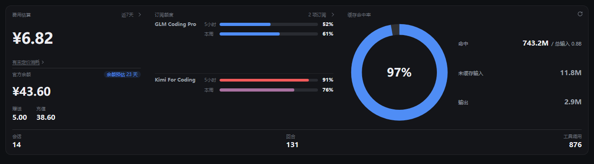
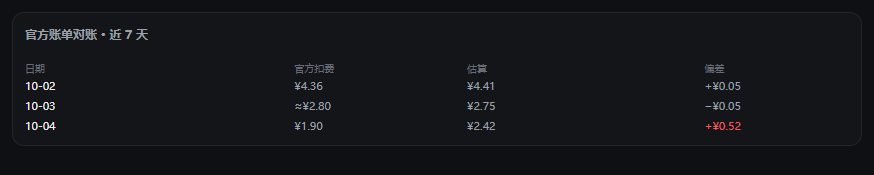

<picture>
  <source media="(prefers-color-scheme: dark)" srcset="assets/logo-dark.svg">
  
</picture>

# dsh-pulse

**简体中文**（默认） · [English](#dsh-pulse-english)

**要求**：dsh ≥ 0.2.0-rc.2 · Node ≥ 22.19 · 可选的终端面需 [dsh-tui](https://github.com/ccch1mneyyy/dsh-TUI) ≥ 0.13.0（独立项目，需单独安装）

**隐私**：数据全部留在本机——用量折自 dsh 自己的会话日志。出站请求只有三类：官方余额查询、订阅额度查询、手动检查更新。

[dsh](https://github.com/deepseek-ai/deepseek-harness) 的会话用量与费用观测台：统计所有会话（活跃和已持久化的）的 token 用量，按内置的 DeepSeek 官方费率估算费用，并显示官方平台余额与第三方订阅额度。Web 面板之外还有终端面：随 dsh-tui 挂载，提供 `/pulse` 命令族（见[终端面](#终端面dsh-tui)）。两个前端都是纯界面，没有模型可见的工具，不消耗任何 token；**用量数据也不挑前端**——Web、dsh-tui、headless、ACP 跑出来的会话都会被统计。



## 功能

- **用量走势**：单日窗口是分时折线图，7 天 / 30 天是每日柱状图，90 天 / 1 年是 GitHub 风格热力图；支持最长 30 天的自定义区间。柱状图两级钻取：点某天 → 按模型铺满全宽，再点某模型 → 展开 / 缓存 / 输出拆分，点空白或 Esc 逐级返回。模型分布与项目排行（占比条 + 排行表）就在走势旁边
- **会话明细与断点分析**：会话按项目分组、带子代理小计（数量 / token / 费用）；展开一个会话，在累计消耗曲线上放最多 3 个断点，逐段读 token 与费用——秒级精度，适合拆「调研 / 思考 / 总结」阶段
- **费用与余额**：逐模型按官方峰谷时段计价，官方余额同卡对照；点开看月度预算与逐日对账表（官方扣费 / 本地估算 / 差额，偏差日标红）。**这是估算器，不是记账**：未定价的模型单独列示，累计未定价 token 不足 5k 视为零头不显示，超过后提示「有未定价消耗」、点击直达定价页
- **订阅额度**：GLM Coding Plan、Kimi For Coding、MiniMax Coding Plan 等月付订阅，一行一家：「5小时 ▮▮ 20%」不悬停直读，超 70% / 90% 百分比加重一档，悬浮看该窗口重置时刻；展开有套餐名与续期、燃速与耗尽时刻预估、联网等附加额度、分项目消耗表。设置里可按供应商关闭查询
- **缓存命中**：命中率环 + 命中 / 总输入、未缓存输入、输出三行，区间内会话 / 回合 / 工具调用活动三格
- **模型配色**：每个模型一个固定颜色，跨窗口、跨界面不变；同屏颜色过近自动拉开，黑白主题下按明度分档保持可读。设置 → 定价与费用 的「模型配色」卡片可为任意模型指定颜色
- **项目 / 模型过滤器**：项目为可搜索下拉框，模型为多选；用量与费用的堆叠图例、模型分布行都可以直接点击，联动同一个筛选集合。从某个会话点 `/` 菜单的 pulse 时，浮层自动把项目过滤到该会话所属工作区，并把当前会话钉在列表顶部
- **精简摘要浮层**：`/` 菜单的 **pulse** 一行打开插件自有的浮层——先给本会话自己的数字，再回答两个具体问题：钱花在哪些模型上（占比条 + 各自费用）、最近是哪些会话；一个按钮原地切到完整观测台
- **自适应与主题**：首行费用 / 订阅 / 缓存三区块随面板宽度自动换行，窄面板不挤压；完整观测台左缘可拖拽无级调宽（600–1280px）。主题蓝 / 粉 / 橙 / 黑白，自动跟随宿主亮暗

费用估算块展开后的逐日对账（≈ 为快照稀疏的日，红色为偏差日）：



## 快速上手

```bash
dsh plugin --profile web add -w dsh-pulse
```

重启 `dsh web`，打开 **设置 → 用量观测台**。入口有三处：侧栏底部按钮直接打开完整面板；任意对话 `/` 菜单的 **pulse** 一行打开按该会话工作区限定的精简浮层；完整观测台左缘可拖拽调宽。所有入口共用同一个数据源 `GET /pulse/stats`。

若已存有 `DEEPSEEK_API_KEY`，仪表盘还会显示官方余额，并在快照积累一天后出现对账线。

## 安装 / 卸载 / 更新

`dsh plugin --profile <name> <args>` 在 profile 目录内调用 pnpm（参数原样透传），并自动调和 `dsh.profile.bundles`。profile 是 pnpm workspace 根，所以 `add` / `remove` 要带 `-w`。

```bash
# 安装：任选一种来源
dsh plugin --profile web add -w dsh-pulse                              # npm registry
dsh plugin --profile web add -w /abs/path/to/dsh-pulse-0.6.0.tgz      # 打包的 tarball（本仓库版本 0.6.0）
dsh plugin --profile web add -w link:/abs/path/to/dsh-pulse           # 源码检出（开发）
dsh plugin --profile web add -w git+https://github.com/Enc-hanted/dsh-pulse

# 确认装的是哪个版本、什么形态（link 会显示 link: 路径）
dsh plugin --profile web list -w dsh-pulse

# 更新：registry 安装拉到最新发布版；tarball / link 安装则重新 add 覆盖
dsh plugin --profile web add -w dsh-pulse@latest

# 卸载
dsh plugin --profile web remove -w dsh-pulse
```

安装、更新或卸载之后都要**重启 `dsh web`**：宿主半（投影单元与 HTTP 路由）在插件加载时注册，必须重启；只换了客户端 bundle 时整页刷新即可。

**检查更新**：**设置 → 用量观测台 → 关于** 显示当前版本，「检查更新」按钮手动询问一次 npm registry，给出「已是最新 / 有新版本 / 开发版 / 检查失败」四种结果。绝不自动检查——无定时器、不在加载时探测。

可选残留，均可安全删除：`~/.dsh/settings.yaml` 里的 `pulse` 节（0.1.6 及以前的宿主）、活跃 profile patch 里的 `pulse` 行（0.1.7+ 宿主把设置存在那里）、以及 `~/.dsh/storages/pulse_balance.json`。卸载或删掉它们**不会丢历史用量**——见下一节。

## 数据与存储

用量统计没有插件私有的历史缓存：**事实来源是 dsh 自己的会话日志**，数字在每次请求时折出来。

| 数据 | 位置 | 归属 | 删掉会怎样 |
| --- | --- | --- | --- |
| 原始用量事件（每个 step 的 token 与计费依据） | `~/.dsh/sessions/` | dsh | 真的丢历史 |
| `pulseUsage` 投影缓存 | `~/.dsh/storages/session_projcache.json` + `session_projcache/` | dsh（插件只注册投影单元） | 自动从会话日志重算 |
| 官方余额快照（滚动 30 天，只存金额，不存 key） | `~/.dsh/storages/pulse_balance.json` | 插件唯一的私有持久文件 | 只丢「官方扣费」对账线历史 |
| 订阅额度利用率快照（滚动 30 天，每窗口百分比点） | `~/.dsh/storages/pulse_quota.json` | 燃速预估的历史 | 只丢燃速斜线，下次查询重新积累 |
| 单价 / 汇率 / 币种 / 面板开关 | profile 的 settings（`~/.dsh/settings.yaml` 或活跃 profile patch 的 `pulse` 行） | dsh settings | 回到默认 |
| 主题 / 面板 / 预算 / 对比 / 浮层宽度 | 浏览器 localStorage（`dsh-pulse:*`） | 浏览器 | 纯偏好，无用量数据 |

所以卸载重装（甚至删掉 `session_projcache`）之后，历史用量会完整重算，不需要任何迁移。请求级的 payload 缓存只在宿主进程内存里（短 TTL），重启即空，同样不含历史。

## 费用模型

单价为**每百万 token 的 CNY 金额**，默认值来自官方价格页
https://api-docs.deepseek.com/zh-cn/quick_start/pricing/（核对于 2026-09-18）。
DeepSeek 按峰谷时段计费：北京时间 **09:00–12:00** 与 **14:00–18:00** 为高峰，且**仅周一至周五**；其余时段（含整个周末）谷价 = 峰价的一半。

| 模型 | 时段 | 未缓存输入 | 缓存命中 | 输出 |
|---|---|---|---|---|
| deepseek-flash | 高峰 | 2 | 0.04 | 8 |
| deepseek-flash | 谷时 | 1 | 0.02 | 4 |
| deepseek-v4-pro | 高峰 | 9 | 0.3 | 27 |
| deepseek-v4-pro | 谷时 | 4.5 | 0.15 | 13.5 |

`deepseek-v4-flash` 与 `deepseek-v4-flash-vision-exp` 是已下线的旧模型名：平台仍接受调用，但实际由 DeepSeek-V4.1-Flash 提供服务并按 Flash 价计费，因此本插件把这些历史事件按 Flash 档计价，而不是再列一行过期单价。

规则可以更细：

- 高峰时段默认**仅工作日**生效；`weekdaysOnly: false` 让某条规则的高峰每天都算，`peakHours: []` 仍表示平价
- 按**供应商**限定：`provider` 填供应商 route id 时只对该供应商的同名模型生效（精确匹配优先），留空则通配该模型 id 的所有供应商——给「代理商也卖 deepseek-v4-flash」这类情况单独定价，不影响官方渠道
- 供应商可整体标记为**月付费**（`monthlyProviders`）：该供应商所有模型无需单价、费用按 0 边际计；可附**月付金额**（`monthlyFee`），不进按量估算，只在方案对比里作为订阅行同台比较

官方 `web_search` 与会话标题生成的辅助 LLM 调用本地没有 usage 事件，观测台按会话日志精确计数，折算为「辅助调用（估算）」伪模型行进入模型堆叠与费用走势，按事件当日生效的官方价计费。**形状自校准（默认开启）**：官方余额序列是每日真值，面板据此自动校准辅助调用的估算形状——对已存数据的纯函数，无新存储、无定时器，换一个部署会自己收敛到那个部署的负载。近 7 个完整日出现 ≥15% 且 ≥¥0.10 的对账偏差时，仪表盘亮**对账漂移告警**（悬停看逐日对照）；快照稀疏的日子不参与学习与告警。想冻结自校准，在配置里手写 `searchShape`（键 `miss`/`hit`/`out`）即可。

币种：每条规则以 **CNY**（默认）或 **USD** 计价，USD 模型通过 `usdToCny`（默认 6.8，定价页可改）折算，总额永远是单一 CNY 数字。折算按设计就是手动汇率：这是估算器，不是记账。`costEnabled: false` 隐藏费用数字，其余照常。

## 配置

设置 → 用量观测台 → **定价与费用** 编辑单价。模型行**只来自 Models 设置页的模型配置**（不可手动添加/删除），DeepSeek 官方单价自动回填；**只保存你改过的行**——没动的模型继续跟随官方通配默认价，官方改价自动跟上，「恢复官方价」把一行清回未改状态。每行填谷时输入 / 缓存命中 / 输出单价、CNY/USD 选择器与 24 小时高峰条（北京时间，默认官方窗口，全部取消 = 平价）。每个供应商分组头有**月付费**开关；页面底部**模型配色**卡片可为模型指定颜色或回到自动色。**刷新目录**重读模型目录；**启用费用估算**整体关掉费用数字。

**方案对比**（设置 → 用量观测台 → 方案对比）：用可调的用量场景（总输入、输出占比、缓存命中率）对比各模型费率下的预估成本。方案直接来自定价页的有效规则（含官方默认），费率改动自动生效；可临时添加对比方案，所有方案可显隐，场景可取自真实用量窗口或手动设置。

**显示设置**：控制各面板显隐与侧栏余额开关，并选择**配色**（蓝 / 粉 / 橙 / 黑白，自带亮暗两版、自动跟随宿主主题）。仪表盘上的**月度预算**卡片设定 CNY 预算，显示本月已用、进度条与按日均速率推算的月底预测。均为本地偏好。

保存立即生效、重启后仍在；与其他窗口的保存撞车时编辑器自动刷新本地副本以便重试。显示类字段（汇率、币种、面板开关）的修改不重启插件。宿主没有设置服务时页面只读，没有 `llm` 服务时无可编辑行。

按 profile 在 `cordis.patch.yml` 覆盖：

```yaml
- insert:
    - id: pulse
      name: 'dsh-pulse'
      config:
        defaultDays: 30   # 客户端未带范围时服务的窗口
        topProjects: 8    # 项目排行行数上限
        projectDepth: 1   # 项目标签保留的路径段数（1..3）
        costEnabled: true # false 隐藏费用数字
        usdToCny: 6.8     # 统一 CNY 总额的 USD→CNY 汇率
        monthlyProviders: []   # 包月订阅的供应商 route id，其模型费用按 0 计
        monthlyFee: {}         # 供应商 route id → 月付金额（CNY/月），用于方案对比展示
        quotaOff: []           # 关闭订阅额度查询的供应商 route id
        searchShape: {}        # 手动指定搜索调用形状 {miss, hit, out}（token/次）；留空 = 自校准
        pricing:          # 逐模型覆盖内置默认
          - model: deepseek-v4-pro
            input: 4.5
            cacheRead: 0.15
            output: 13.5
            peak:         # 峰时单价（默认官方窗口）
              input: 9
              cacheRead: 0.3
              output: 27
            currency: CNY
          - model: third-party-x   # 平价 USD 规则 + 自定义高峰时段
            input: 0.5
            output: 2
            currency: USD
            peakHours: [0, 1, 2, 3, 4, 5]   # 按北京时间计峰的小时
          - model: weekend-peak    # 这些小时每天都算高峰（含周末）
            input: 1
            output: 2
            peak: { input: 2, output: 4 }
            peakHours: [9, 10, 11]
            weekdaysOnly: false
          - provider: pi-ai         # 只对该供应商的同名模型生效
            model: deepseek-v4-flash
            input: 2
            output: 4
```

## 官方余额

`GET /pulse/balance` 用宿主已存的 key 查询 DeepSeek 开放平台：零新增配置、零新增密钥存储，key 不离开宿主进程（只出现在一次出站 `Authorization` 头里），失败映射为通用原因码并在卡片内联重试，服务端缓存 60 秒（面板的刷新按钮即强制刷新）。未配置时余额块整体隐藏。

每次成功查询把 `{t, total}` 快照（只有金额）记入滚动 30 天的存储（上限 1000 条、5 分钟去重）。每日官方扣费由余额序列推算，推不出来的日子（充值掩盖、缺少前序快照）记为空，费用走势把它画成第三条细线。注意这是那把 key 的**总扣费**：别的工具共用同一把 key 时也会算进来。

## 订阅额度

`GET /pulse/quota` 查询**月付订阅**（Coding Plan / Token Plan）的剩余额度，安全姿态与官方余额相同：凭据每操作现取，只出现在一次出站 `Authorization` 头里；快照只记录每个窗口的利用率百分比（滚动 30 天，去重 + 上限），永不落任何密钥或原始响应。服务端缓存 60 秒。

内置适配器（按 Models 目录的供应商路由自动识别，无需配置）：

| 适配器 | 路由 | 端点 | 返回 |
| --- | --- | --- | --- |
| zai-coding | `zai-coding-cn` / `zai-coding` / `zai` | `open.bigmodel.cn` 或 `api.z.ai` 的 `/api/monitor/usage/quota/limit` + `/api/biz/subscription/list` | 5h/周 token 窗口百分比、重置时刻、联网工具次数、套餐名与年/月费 |
| kimi-coding | `kimi-coding` / `kimi` | `api.kimi.com/coding/v1/usages` | 周/5h 请求窗口百分比（比率源只报百分比，不生成次数） |
| minimax | `minimax` / `minimax-coding` | `api.minimaxi.com/v1/token_plan/remains` | 5h/周窗口（社区文档口径，未实测） |

这些多是**未承诺 SLA 的内部端点**（社区工具同款），解析全部防御式：字段缺失降级为「未知」而不是 0%，失败以通用原因码呈现。

**估算口径**（面板小字同步声明）：订阅额度只有百分比，没有绝对 token 数。dsh 用本地记录反推——同一时间跨度内该供应商路由的本地 token 消耗 ÷ 服务端百分比 = 估算总额，再给剩余量。**dsh 只覆盖这台机器经它跑的流量**：key 还被别的工具共用时估算偏低，仅供趋势参考，不是记账。燃速预估来自快照序列的线性斜率，给出「按此速率何时耗尽」与「重置时预计百分比」。

**分项目消耗**：把窗口（或本月）内该供应商的本地 token 按会话工作目录归因到项目——各项目的 token、份额条，以及**月费分摊**（套餐费 × 份额；套餐未公开价格时只显示份额）。设置 → 显示设置里可按供应商关闭查询。

## 扩展仪表盘（面向插件作者）

在 0.1.7+ 宿主上，仪表盘是一个 **Component Factory**（`pulse.dashboard`，root 作用域，locale `dsh-pulse`，带 **store seat**），声明了三个子槽位：

| 槽位 | 类型 | 渲染位置 |
| --- | --- | --- |
| `pulse.dashboard.chip` | `list` | 内置 chip 之后的 KPI 卡片 |
| `pulse.dashboard.filter` | `list` | 工具栏中项目/模型选择器之后的控件 |
| `pulse.dashboard.panel` | `list` | 内置面板之后（仅在数据加载完成且非空的视图中） |

注入方式：

```js
ctx.slots.inject("pulse.dashboard.panel", () => ctx.slots.register({
  name: "pulse.dashboard.panel", id: "my-panel",
}, MyPanel));
```

条目会收到工厂 locale 提供的 `t`、**store seat**——`useStore((s) => s)` 选择 `{data, view, busy}` 且跨窗口切换/重折叠保持实时，以及写回用的 `actions.sync(data, view, busy)`——外加渲染点 props `{data, view, busy}` 作为同帧快照。面板逐个受监督：某个面板崩溃只会上报并移除自身，不会拖垮仪表盘。任何插件也可以用 `renderFactorySlot("pulse.dashboard", { … })` 把整个仪表盘挂到别处（接受可选的 `floatActions` / `headerExtra` / `onConfigure` props，支持 `fallback`）。在没有 Factory API 的宿主上插件全部直渲染，扩展点自动休眠。

除仪表盘外，插件还向宿主自身的席位贡献内容（缺席时降级并在日志告警一次）：**`plugins.row.config`**——完整定价编辑器渲染在插件管理器的 bundle 详情页；**`plugins.detail.badge` / `plugins.detail.section`**——详情页的标签与介绍卡片；**`settings.general.item`**——侧栏余额指示器作为「通用」设置页的原生开关（需要 store 引擎，旧宿主上隐藏）。

## 兼容性

同一份构建覆盖 dsh 各代际，接缝在运行时探测：要求的宿主能力缺席时相应席位自动降级（例如 store 引擎缺失 → 侧栏同步与设置页席位退场，仪表盘照常工作），扩展面板崩溃也只移除自身、不拖垮仪表盘。客户端半声明 `platform: "web"`，Web 面板只在 Web 前端出现；**用量数据不受前端影响**——任何前端（Web / dsh-tui / headless / ACP）跑出来的会话都会被统计。统计载荷 schema 2–4 可互读，宿主与浏览器 bundle 版本短期不一致也能正常工作。历史代际的适配记录见 [CHANGELOG](./CHANGELOG.md)。

## 终端面（dsh-tui）

同一个包随 [dsh-tui](https://github.com/ccch1mneyyy/dsh-TUI)（≥ 0.13.0，DeepSeek Harness 的第三方交互式终端前端）挂载为终端面 `dsh-pulse/tui`，与 Web 面共享同一份折叠、定价与配置数据。dsh-tui 需单独安装；不用 dsh-tui 可跳过本节。

**六个命令**（输入框 `/` 菜单）：`/pulse` 迷你卡开关（同 alt+p）；`/pulse-day` 今日日视图（面包屑 + 摘要 + 分时 gantt + 会话台账，`s` 切排序）；`/pulse-month` 本月月历热力 + 周趋势 + 模型分解；`/pulse-year` 近一年 53 周热力图；`/pulse-cost` 今日成本口径（场景内 `t` 在 cost/token 间切换）；`/pulse-sessions` 会话切换（打字过滤 + 两步确认）。

**迷你卡**：输入框上方的 3 行封顶卡片（pointer-only，不占键盘）。今日行拆 ● 当前会话 / ○ 其余（今日切片，绝无终身累计），本月行带对数 sparkline，未计价份额成 ⚠ 行；点卡片体进全量视图，`×` 收起。**Esc** 在全量场景里逐级返回（日 → 月 → 年），顶层 Esc 回聊天；`?` 帮助、`e` 导出 CSV、`r` 强刷。

**降级行为**：宿主缝缺席时逐级降级——命令注册被拒则 `/pulse` 直开全量日视图；场景服务缺席则面板红字提示、静默退出。启动日志出现一条 `falling back to direct commands.register (C-070, unattributed)` 属预期行为，非故障。宿主 0.2.0 起不再暴露会话活跃时间戳：被另一个进程追加的持久会话不会自动重折，需在场景里按 `r` 手动刷。

**诊断**：用宿主命令 `/plugins check <dsh-pulse 路径>` 可静态校验 manifest（应报 `compatible`）；环境变量 `PULSE_TUI_DEBUG=1` 在插件加载时向 stderr 输出一行缝可见性诊断。

## FAQ

- **面板没有数据？** 用量折自 dsh 自己的会话日志——刚装完没有可折的历史，跑一会话就有了；确认安装在活跃 profile 且重启过 `dsh web`。
- **官方余额不显示？** 需要宿主已配置 DeepSeek API key（`DEEPSEEK_API_KEY` 或客户端登录）；未配置时余额块整体隐藏，不报错。
- **官方扣费和本地估算对不上？** 官方扣费是那把 key 的总扣费——别的工具共用同一把 key 会算进来；辅助调用（搜索、标题生成）本身是估算，面板会自校准并在持续偏差时亮对账漂移告警（悬停看逐日对照）。
- **订阅额度的百分比是准的吗？** 服务端只给百分比；面板用本地用量反推总额与剩余，key 被其他工具共用时估算偏低——看趋势，别当账本。
- **tui 启动日志有 C-070 行？** 预期行为，见[终端面](#终端面dsh-tui)的降级行为，非故障。
- **保存设置返回 409？** 与其他窗口的保存撞车了，编辑器已自动刷新本地副本，重试即可。
- **为什么 `/` 菜单里只有一行 pulse？** 插件以客户端贡献方式提供这个入口（自带图标、文案随界面语言走），不注册宿主命令——否则 dsh 会按名字合并多出一行无图标的目录行。

## 开发

```bash
npm test                    # host / aggregate / view / client-smoke / tui / golden / style / manifest 八个套件
npm run build               # 改 src/ 后重新构建 lib/client.js（esbuild）
```

其中 `client-smoke` 在 react 桩下把仪表盘的派生模型钩子真实执行一遍：打包器照不出「名字落在另一个函数作用域」的搬运事故，它是浏览器之外唯一的运行时防线。

注释语言规约：JSDoc（对外契约、`@param`/`@returns`）一律英文；段落级设计注记可用中文；描述旧机制的注释随机制一起删，不与新代码叠放。

特别致谢 [Linux Do](https://linux.do/) 社区。

MIT — 见 [LICENSE](./LICENSE)。

---

# dsh-pulse (English)

[简体中文](#dsh-pulse) · **English**

**Requirements**: dsh ≥ 0.2.0-rc.2 · Node ≥ 22.19 · the optional terminal face needs [dsh-tui](https://github.com/ccch1mneyyy/dsh-TUI) ≥ 0.13.0 (a separate project, installed on its own)

**Privacy**: everything stays on this machine — usage is folded from dsh's own session logs. Outbound requests come in exactly three kinds: official-balance queries, subscription-quota queries, and the manual update check.

A per-session usage and cost observatory for [dsh](https://github.com/deepseek-ai/deepseek-harness): it aggregates token usage across all sessions (live and persisted), estimates cost from built-in DeepSeek rates, and shows the official platform balance and third-party subscription quotas. Beyond the web panel there is a terminal face that mounts into dsh-tui and serves the `/pulse` command family (see [Terminal face](#terminal-face-dsh-tui)). Both frontends are pure UI — no model-visible tools, zero tokens spent — and **usage data does not care which frontend produced it**: sessions from Web, dsh-tui, headless and ACP are all counted.


## Features

- **Usage trends**: hourly line chart for a single day, daily bars for 7/30 days, GitHub-style heatmap for 90 days/1 year; custom date ranges up to 30 days. The bar chart drills two levels: click a day to sweep it full width by model, click a model for its input/cache/output split — click empty space or press Esc to unwind. Model distribution and project ranking (share bars + ranked table) sit right beside the trend
- **Session detail & break analysis**: sessions grouped by project with a subagent subtotal (count / tokens / cost); expand a session and place up to three breaks on its cumulative-consumption curve to read per-segment tokens and cost at second accuracy — good for splitting a task into research / thinking / summary stages
- **Cost & balance**: per-model rates priced at the official peak/off-peak schedule, with the official balance on the same card; expand for the monthly budget and a per-day reconciliation table (official spend / local estimate / gap, drifted days in red). **This is an estimator, not accounting**: unpriced models are listed as such, under 5k unpriced tokens counts as rounding noise and renders nothing, past that the card says "some usage unpriced" and clicking it opens the pricing page
- **Subscription quota**: flat-rate plans (GLM Coding Plan, Kimi For Coding, MiniMax Coding Plan …) one provider per row — `5-hour ▮▮ 20%` reads without hover, the percentage gains a weight step past 70% / 90%, hover shows that window's reset instant; the expansion holds plan name and renewal, burn-rate and exhaustion forecasts, web-tool extras, and a per-project burn table. Queries toggle per provider in settings
- **Cache hit rate**: the hit ring plus hit / total input, uncached input and output lines, and the in-window activity cells (sessions / turns / tool calls)
- **Model colours**: every model wears one colour, stable across windows and surfaces; colours too close on one screen are pulled apart automatically, and the B&W theme sorts them into a lightness ladder. The **Model colours** card under Settings → Pricing pins any model to a colour of your own
- **Project / model filters**: projects pick from a searchable dropdown, models are a multi-select; the usage and cost stack legends and the model-distribution rows all click-toggle the same filter set. Opening `/` → pulse from a session scopes the overlay to that session's workspace and pins the current session to the top of its list
- **Compact summary overlay**: the `/` menu's **pulse** row opens the plugin's own overlay — this session's numbers first, then two concrete questions answered: which models spent the money (share bars with each cost) and which sessions ran recently; one button hands over to the full observatory
- **Adaptive layout & themes**: the three first-row blocks (cost / quota / cache) rewrap with the panel width and never squeeze on a narrow panel; the full observatory's width drags continuously (600–1280px). Themes: blue / pink / orange / B&W, following the shell's light-dark automatically

The cost block expanded into its per-day reconciliation (≈ marks snapshot-sparse days, red marks drift):


## Quick start

```bash
dsh plugin --profile web add -w dsh-pulse
```

Restart `dsh web`, then open **Settings → Usage Pulse**. Three entrances: the sidebar foot button opens the full observatory directly; in any conversation the `/` menu's **pulse** row opens the compact overlay scoped to that session's workspace; the full view's left edge drags to resize. All entrances share one data source, `GET /pulse/stats`.

With a stored `DEEPSEEK_API_KEY`, the dashboard also shows the official balance and, after a day of snapshots, the reconciliation line.

## Install / Uninstall / Update

`dsh plugin --profile <name> <args>` runs pnpm inside the profile directory (arguments pass through) and reconciles `dsh.profile.bundles` automatically. Profiles are pnpm workspace roots, hence the `-w` on `add` / `remove`.

```bash
# install — pick one source
dsh plugin --profile web add -w dsh-pulse                              # npm registry
dsh plugin --profile web add -w /abs/path/to/dsh-pulse-0.6.0.tgz      # packed tarball (this repo: 0.6.0)
dsh plugin --profile web add -w link:/abs/path/to/dsh-pulse           # source checkout (development)
dsh plugin --profile web add -w git+https://github.com/Enc-hanted/dsh-pulse

# confirm which version and form is installed (a link shows the link: path)
dsh plugin --profile web list -w dsh-pulse

# update — a registry install pulls the latest published version;
# a tarball / link install is replaced by re-running add
dsh plugin --profile web add -w dsh-pulse@latest

# uninstall
dsh plugin --profile web remove -w dsh-pulse
```

Restart `dsh web` after any install, update or removal: the host half (projection unit and HTTP routes) registers at plugin load, so a restart is required; a client-bundle-only change just needs a page reload.

**Update check**: **Settings → Usage Pulse → About** shows the running version, and the **Check for updates** button asks the npm registry once, reporting up to date / newer version / development build / failure. It never checks on its own — no timer, no probe at load.

Leftovers, all safe to delete: the `pulse` section in `~/.dsh/settings.yaml` (hosts up to 0.1.6), the `pulse` row in the active profile patch (0.1.7+ hosts store settings there), and `~/.dsh/storages/pulse_balance.json`. Removing them — or the plugin itself — **loses no usage history**; see the next section.

## Data & storage

Usage statistics have no plugin-private history cache: **dsh's own session logs are the source of truth**, and every number is folded at request time.

| Data | Location | Owned by | What deleting it costs |
| --- | --- | --- | --- |
| Raw usage events (per-step tokens and the billing basis) | `~/.dsh/sessions/` | dsh | the actual history |
| `pulseUsage` projection cache | `~/.dsh/storages/session_projcache.json` + `session_projcache/` | dsh (the plugin only registers the projection unit) | nothing — it is refolded from the session logs |
| Official-balance snapshots (rolling 30 days, money only, never the key) | `~/.dsh/storages/pulse_balance.json` | the plugin's only private durable file | the official-spend reconciliation line only |
| Subscription-quota utilization snapshots (rolling 30 days, per-window percentage points) | `~/.dsh/storages/pulse_quota.json` | the burn-rate history | the burn slope only; it re-accumulates from the next query |
| Pricing / FX rate / currency / panel toggles | the profile's settings (`~/.dsh/settings.yaml` or the `pulse` row in the active profile patch) | dsh settings | back to defaults |
| Theme / panels / budget / compare / overlay width | browser localStorage (`dsh-pulse:*`) | the browser | preferences only, no usage data |

So uninstalling and reinstalling (even deleting `session_projcache`) refolds the whole history with no migration. The request-level payload cache lives in host process memory only (short TTL) and holds no history.

## Cost model

Rates are **CNY per million tokens**; defaults are built in from the official price page (https://api-docs.deepseek.com/zh-cn/quick_start/pricing/, checked 2026-09-18). DeepSeek bills by peak/off-peak windows: Beijing time **09:00–12:00** and **14:00–18:00**, **Monday to Friday only** — every other hour, including the whole weekend, is off-peak at half the peak rate.

| model | tier | uncached input | cache-hit input | output |
|---|---|---|---|---|
| deepseek-flash | peak | 2 | 0.04 | 8 |
| deepseek-flash | off-peak | 1 | 0.02 | 4 |
| deepseek-v4-pro | peak | 9 | 0.3 | 27 |
| deepseek-v4-pro | off-peak | 4.5 | 0.15 | 13.5 |

`deepseek-v4-flash` and `deepseek-v4-flash-vision-exp` are retired ids: the platform still accepts them and serves them as DeepSeek-V4.1-Flash at Flash rates, so this plugin prices those events at the Flash tier instead of listing a second, stale rate row.

Rules can go finer:

- Peak hours are weekdays-only by default; `weekdaysOnly: false` bills a rule's peak hours every day, and an empty `peakHours` list still means flat pricing
- **Provider-scoped**: a `provider` holding a route id prices only that provider's same-named model (exact match wins); left empty the rule covers the model id from every provider — so a reseller serving `deepseek-v4-flash` can be priced separately without touching the official channel
- A provider can be marked **monthly-paid** as a whole (`monthlyProviders`): its models need no rates and price at zero marginal cost, with an optional **monthly amount** (`monthlyFee`) that stays out of the pay-per-token estimate and surfaces only in plan comparison

The official `web_search` and session-title LLM calls have no local usage events; the observatory counts them exactly from the session logs and folds them into an `Aux calls (est.)` pseudo-model row, priced at the day's official rates. **Self-calibrating shape (on by default)**: the official balance series provides daily ground truth, and the panel calibrates the aux estimate shape against it — a pure function of already-stored data, no new storage, no timers; each deployment converges to its own workload. When any of the last 7 complete days drifts ≥15% **and** ≥¥0.10 from the estimate, the dashboard raises a **reconciliation drift alert** (hover for the per-day breakdown); snapshot-sparse days join neither learning nor alerting. A manual `searchShape` (`miss`/`hit`/`out` keys) freezes the calibration.

Currency: rules price in **CNY** (default) or **USD**; USD-priced models convert through one configurable rate (`usdToCny`, default 6.8, editable in the pricing page), so the total is always a single CNY sum. The conversion is a manual rate by design: this is an estimator, not accounting. `costEnabled: false` hides the cost figures while keeping every other number.

## Configuration

**Settings → Usage Pulse → Pricing & cost** edits the rates. Rows come **only from the Models settings page's configured models** (no manual add/delete), with official DeepSeek rates auto-filled. **Only rows you edited are saved** — untouched models keep following the official wildcard defaults, so official rate changes reach them automatically, and **Official rates** clears a row back to that untouched state. Each row takes off-peak input / cache-hit / output rates, a CNY/USD selector and a 24-hour peak strip (Beijing time, official windows by default, all deselected = flat). Every provider group header has a **Monthly** toggle; the **Model colours** card at the page bottom pins custom colours or returns to auto. **Refresh catalog** re-reads the model catalog; **Enable cost estimates** turns cost figures off entirely.

**Compare plans** (Settings → Usage Pulse → Compare plans) prices a usage scenario (total input, output ratio, cache hit rate) against the effective pricing rules (official defaults included), so rate edits show up here automatically. Temporary plans can be added, every plan can be shown or hidden, and the scenario can come from the real usage window or be set by hand.

**Display settings** toggle each dashboard panel and the sidebar balance indicator, and pick a **theme** (blue / pink / orange / B&W — each with its own light and dark variant, following the shell automatically). The **monthly budget** card on the dashboard takes a CNY budget and shows month-to-date spend, a progress bar and a run-rate month-end forecast. All local preferences.

Saves apply immediately and survive restarts; a save that races another window refreshes the editor's local copy for a clean retry. Display fields (rate, currency, panel toggles) never restart the plugin. Without a settings service the page is read-only; without the `llm` service there are no rows to edit.

Profile overrides in `cordis.patch.yml`:

```yaml
- insert:
    - id: pulse
      name: 'dsh-pulse'
      config:
        defaultDays: 30   # window served when the client sends none
        topProjects: 8    # ranked-project row cap
        projectDepth: 1   # path segments in a project label (1..3)
        costEnabled: true # false hides the cost figures
        usdToCny: 6.8     # USD→CNY rate for the unified CNY total
        monthlyProviders: []   # flat-subscription provider route ids; their models price at 0
        monthlyFee: {}         # provider route id → monthly price (CNY/mo), surfaced in plan comparison
        quotaOff: []           # provider route ids with subscription-quota queries switched off
        searchShape: {}        # manual per-call aux shape {miss, hit, out} (tokens); empty = self-calibrating
        pricing:          # overrides the built-in defaults per model
          - model: deepseek-v4-pro
            input: 4.5
            cacheRead: 0.15
            output: 13.5
            peak:         # peak-hour rates (official windows by default)
              input: 9
              cacheRead: 0.3
              output: 27
            currency: CNY
          - model: third-party-x   # flat USD rule with custom peak hours
            input: 0.5
            output: 2
            currency: USD
            peakHours: [0, 1, 2, 3, 4, 5]   # Beijing-time hours billed at peak
          - model: weekend-peak    # bill those hours on every day of the week
            input: 1
            output: 2
            peak: { input: 2, output: 4 }
            peakHours: [9, 10, 11]
            weekdaysOnly: false
          - provider: pi-ai         # prices only that provider's same-named model
            model: deepseek-v4-flash
            input: 2
            output: 4
```

## Official balance

`GET /pulse/balance` queries the DeepSeek open platform with the key the host already stores: zero new configuration, zero new secret storage, the key never leaves the host process (it appears only in one outbound `Authorization` header), failures map to generic cause codes and retry inline, and replies are cached 60 s server-side (the panel's refresh button is the forced refresh). Unconfigured, the balance section simply hides itself.

Every successful query records one `{t, total}` snapshot (money only) in a rolling 30-day storage (capped at 1000 entries, 5-minute dedupe). Per-day official spend is derived from the balance series; days where it can't be known (a top-up masks the spend, no prior snapshot) are left empty, and the cost trend draws this as a third line. Note that this is that key's **total spend**: tools sharing the key are counted in it too.

## Subscription quota

`GET /pulse/quota` queries the remaining quota of **flat-rate subscriptions** (coding plans, token plans) with the same security posture as the official balance: credentials resolve per operation and live only in one outbound `Authorization` header; snapshots record each window's utilization percentage only (rolling 30 days, deduped, capped) — never a key, never a raw payload. Server-cached 60 s.

Built-in adapters (auto-detected from the Models catalog's provider routes, zero configuration):

| adapter | routes | endpoints | returns |
| --- | --- | --- | --- |
| zai-coding | `zai-coding-cn` / `zai-coding` / `zai` | `open.bigmodel.cn` or `api.z.ai`: `/api/monitor/usage/quota/limit` + `/api/biz/subscription/list` | 5h/weekly token-window percentages, reset instants, web-tool counts, plan name and fee |
| kimi-coding | `kimi-coding` / `kimi` | `api.kimi.com/coding/v1/usages` | weekly/5h request-window percentages (ratio sources render percentage-only, never a count) |
| minimax | `minimax` / `minimax-coding` | `api.minimaxi.com/v1/token_plan/remains` | 5h/weekly windows (community-documented, not live-verified) |

Most of these are **internal endpoints without a committed SLA** (the same ones community tools use); every parser is defensive — a missing field degrades to "unknown", never a fabricated 0%.

**Estimation honesty** (stated in the panel's own footnote): subscriptions report percentages only, never absolute tokens. dsh back-solves them — local tokens for that provider route over the same span ÷ the server's percentage = the estimated total, and the remainder follows. **dsh sees only the traffic it carries**: a key shared with other tools reads low; treat the numbers as trends, not accounting. The burn forecast is a linear slope over the snapshot series, answering "when does it run out at this rate" and "projected percentage at reset".

**Per-project burn**: the window's (or the month's) local tokens for the provider attribute to projects through each session's working directory — tokens, share bars, and the **monthly-fee apportionment** (plan fee × share; share only when the plan hides its price). Queries toggle per provider under Settings → Display settings.

## Extending the dashboard (for plugin authors)

On 0.1.7+ hosts the dashboard is a **Component Factory** (`pulse.dashboard`, root scope, locale `dsh-pulse`, with a **store seat**) declaring three child slots:

| slot | kind | rendered |
| --- | --- | --- |
| `pulse.dashboard.chip` | `list` | KPI tiles after the built-in chips |
| `pulse.dashboard.filter` | `list` | controls after the project/model pickers in the toolbar |
| `pulse.dashboard.panel` | `list` | panels after the built-in ones, in the loaded non-empty view |

Inject a component:

```js
ctx.slots.inject("pulse.dashboard.panel", () => ctx.slots.register({
  name: "pulse.dashboard.panel", id: "my-panel",
}, MyPanel));
```

Entries receive the factory's `t` (the `dsh-pulse` locale), the **store seat** — `useStore((s) => s)` selects `{data, view, busy}` and stays live across range switches and refolds, with `actions.sync(data, view, busy)` for write-back — and the render-site props `{data, view, busy}` as a same-tick snapshot. Panels are supervised individually: a crashing panel is reported and removed without taking the dashboard down. Any plugin can also mount the whole dashboard elsewhere with `renderFactorySlot("pulse.dashboard", { … })` (accepts the optional `floatActions` / `headerExtra` / `onConfigure` props; a `fallback` option is honored). On hosts without the factory API the plugin renders everything directly and the extension points stay dormant.

Beyond the dashboard, the plugin contributes to the shell's own seats (degrading when absent, warning once in the log): **`plugins.row.config`** — the full pricing editor on the bundle's plugin-manager detail page; **`plugins.detail.badge` / `plugins.detail.section`** — the detail page's tag and intro card; **`settings.general.item`** — the sidebar-balance indicator as a native General-settings toggle (requires the store engine, hidden on older hosts).

## Compatibility

One build serves every dsh generation — the seams are detected at runtime: when a required host capability is absent the corresponding seats degrade (a missing store engine retires the live sidebar sync and the settings-page seat while the plain dashboard keeps working), and a crashing extension panel removes only itself. The client half declares `platform: "web"`, so the Web panel appears on the Web frontend only; **usage data is unaffected by the frontend** — sessions from any frontend (Web, dsh-tui, headless, ACP) are counted. The stats payload reads schemas 2–4, so a host and a browser bundle from different releases keep working through an upgrade. Historical per-generation adaptation notes live in the [CHANGELOG](./CHANGELOG.md).

## Terminal face (dsh-tui)

The same package mounts as the terminal face `dsh-pulse/tui` inside [dsh-tui](https://github.com/ccch1mneyyy/dsh-TUI) (≥ 0.13.0, a third-party interactive terminal frontend for DeepSeek Harness), sharing the fold, pricing and config data with the Web face. dsh-tui is installed separately; skip this section if you don't use it.

**Six commands** (the `/` menu): `/pulse` toggles the mini card (same as alt+p); `/pulse-day` opens today's day view (breadcrumb + summary + hourly gantt + session ledger, `s` switches sort); `/pulse-month` the month calendar heat + weekly trend + model breakdown; `/pulse-year` the 53-week year heatmap; `/pulse-cost` today's cost view (`t` toggles cost/token in-scene); `/pulse-sessions` the session switcher (type-to-filter + two-step confirm).

**Mini card**: a 3-row-max card docked above the prompt (pointer-only, never takes the keyboard). The today line splits ● current session / ○ others (today slices, never lifetime totals), the month line carries a log-scaled sparkline, and the unpriced share becomes a ⚠ line; click the body to open the full view, `×` dismisses. **Esc** unwinds the full scene level by level (day → month → year), the top-most Esc returns to chat; `?` help, `e` CSV export, `r` force refresh.

**Degradations**: absent host seams step down level by level — a refused command registration makes `/pulse` open the full day view directly; an absent scene service renders a red failure line and drops out quietly. One `falling back to direct commands.register (C-070, unattributed)` line in the boot log is expected, not a fault. Since host 0.2.0 no longer exposes session activity timestamps, a persisted session appended by ANOTHER process does not refold automatically — press `r` in the scene to refresh.

**Diagnostics**: `/plugins check <dsh-pulse path>` statically validates the manifest (it should report `compatible`); setting `PULSE_TUI_DEBUG=1` makes the plugin emit one stderr diagnostic line (seam visibility) at load time.

## FAQ

- **The panel has no data?** Usage folds from dsh's own session logs — a fresh install has nothing to fold yet, so run a session; also confirm the plugin is installed into the active profile and `dsh web` was restarted.
- **No official balance?** It needs the host to have a DeepSeek API key configured (`DEEPSEEK_API_KEY` or a client sign-in); unconfigured, the balance section hides itself rather than erroring.
- **Official spend and the local estimate disagree?** The official figure is that key's total spend — tools sharing the key are counted in; aux calls (search, titles) are estimates by nature, and the panel self-calibrates and raises a drift alert when the gap persists (hover for the per-day breakdown).
- **Are the subscription percentages accurate?** The server reports percentages only; the panel back-solves totals and remainders from local usage, which reads low when the key is shared — read them as trends, not accounting.
- **A C-070 line in the tui boot log?** Expected, see the terminal face's degradations — not a fault.
- **A save returned 409?** Another window raced the save; the editor already refreshed its local copy — retry.
- **Why is there only one pulse row in the `/` menu?** The row is a client contribution (it carries its own icon and follows the UI language); the plugin registers no host command, which would merge into an extra glyph-less catalog row.

## Development

```bash
npm test                    # host / aggregate / view / client-smoke / tui / golden / style / manifest suites
npm run build               # rebuild lib/client.js from src/ (esbuild)
```

Of these, `client-smoke` executes the dashboard's derived-model hook for real under react stubs: the bundler cannot catch a name left behind in another function's scope, and this suite is the only runtime line of defense outside the browser.

Special thanks to the [Linux Do](https://linux.do/) community.

MIT — see [LICENSE](./LICENSE).
